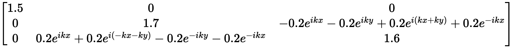
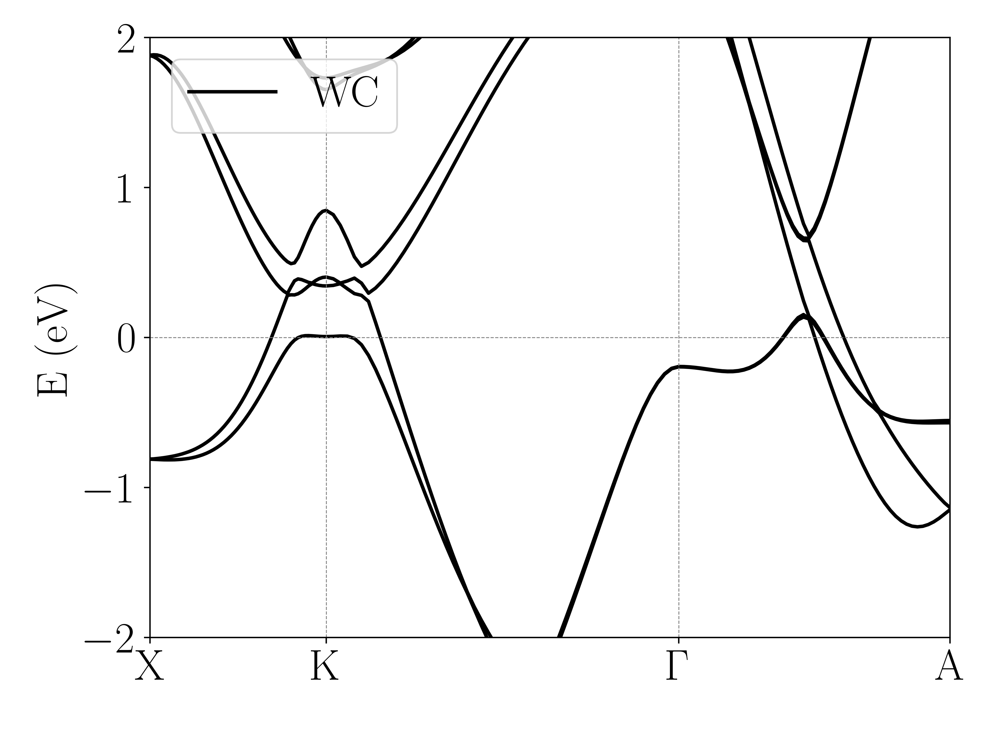
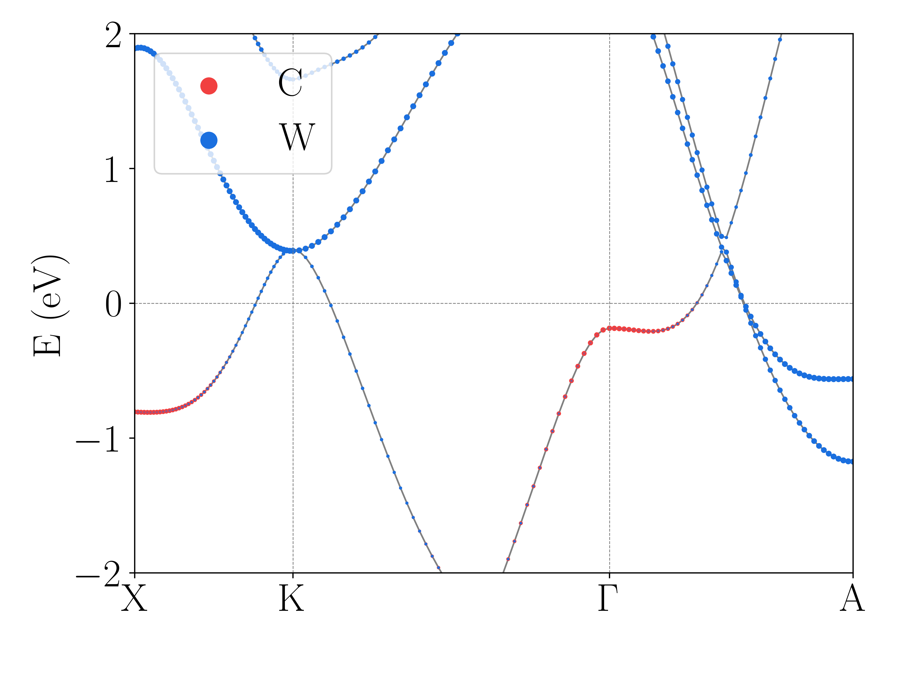

# W2TB--From WANNIER90 to Tight-Binding(TB) Model
[中文简介](README_zh.md)

By reading the seedname_hr.dat file output from WANNIER90, combined with the information in seedname.win, one can construct the Hamiltonian of the tight-binding model, and also calculate the energy bands.

## Key Features
- Construct a tight-binding model
- Display the expressions of the tight-binding model, directly obtaining the numerical values of various hoppings
- Calculate and plot energy bands, including standard band structure diagrams and fatband plots
- Block processing of the tight-binding model Hamiltonian

## Installation

```bash
git clone + project address
```
Or download the zip file directly.

## Usage Example
Using the calculation of Tungsten Carbide (WC) as an example

Refer to [Example](Example.ipynb) for details, do not forget to unzip the file wannier90_hr.dat.tar.gz.

First, import the module wann2tb, then initialize the object and read the file.
```python
import wann2tb as wtb
WC = wtb.tb_h(fermi=8.2, dn=4, seedname="wannier90")
```
Next, view a part of the constructed tight-binding model Hamiltonian (the entire matrix is too large).
```python
WC.show_Hmatrix(r1=[-1,1], r2=[-1,1], r3=[-1,1], rr=[1], cr=[1], dn=1, nm=0.15)
```

Then, calculate the band structures.
```python
kpath = [[0.5, 0.0, 0.0], [0.33333, 0.33333, 0.0], [0.0, 0.0, 0.0], [0.0, 0.0, 0.5]]
klabels = [r"$\mathrm{X}$", r"$\mathrm{K}$", r"$\mathrm{\Gamma}$", r"$\mathrm{A}$"]
band = WC.band_cal(kpath=kpath, kn=50, klabels=klabels, R1r=[-2,2], R2r=[-2,2], R3r=[-2,2], rr=[0,1,2,3])
```
Plot the band diagram.
```python
wtb.band_plot(bandlist=[[band, 'black', r"$\mathrm{WC}$"]], ed=-2, eu=2, filename="wholeband.png")
```


One can also block process the tight-binding model Hamiltonian, for example, separating the spin-up and spin-down orbitals, calculating their energy bands, and drawing them separately.
```python
band_up = WC.band_cal(kpath=kpath, kn=50, klabels=klabels, R1r=[-2,2], R2r=[-2,2], R3r=[-2,2], rr=[0,1])
band_dn = WC.band_cal(kpath=kpath, kn=50, klabels=klabels, R1r=[-2,2], R2r=[-2,2], R3r=[-2,2], rr=[2,3])
wtb.band_plot(bandlist=[[band_up, wtb.red, "Spin up"], [band_dn, wtb.blue, "Spin down"]], ed=-2, eu=2, filename="spinband.png")
```

The return value of band_cal also includes wave function information, so one can use the built-in band_plot function to draw fatband diagrams, for example:
```python
wtb.band_plot(bandlist=[[band_up, wtb.red, r"$\mathrm{C}$", [0,0,0,0,0,0,0,0,0,1,1,1]], [band_up, wtb.blue, r"$\mathrm{W}$", [1,1,1,1,1,1,1,1,1,0,0,0]]], ed=-2, eu=2, filename="fatband.png")
```

## Contact
If needed, you can contact me via QQ.

Or you can contact me by E-mail:
fy_wang_phy@163.com