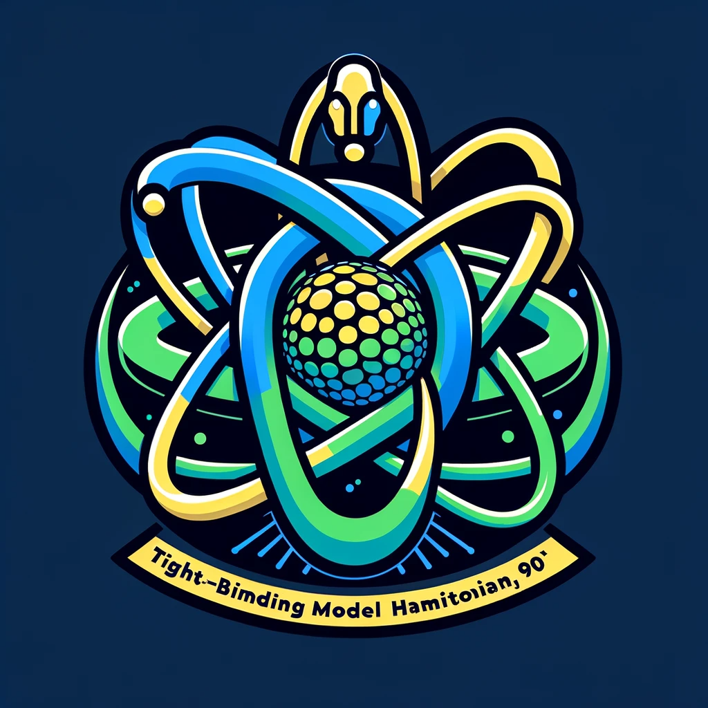
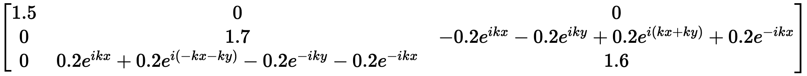
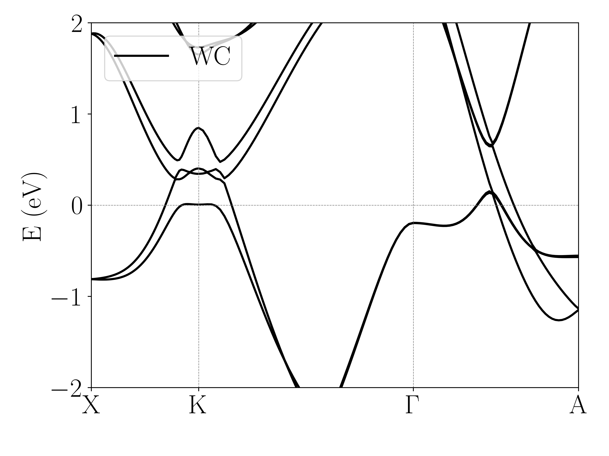
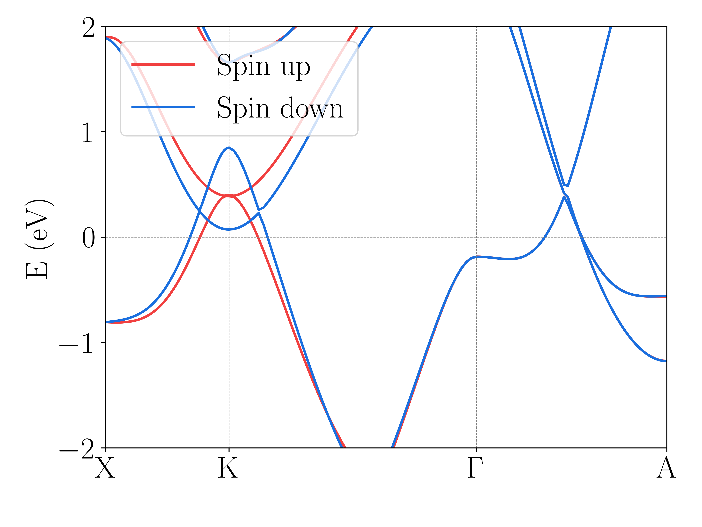
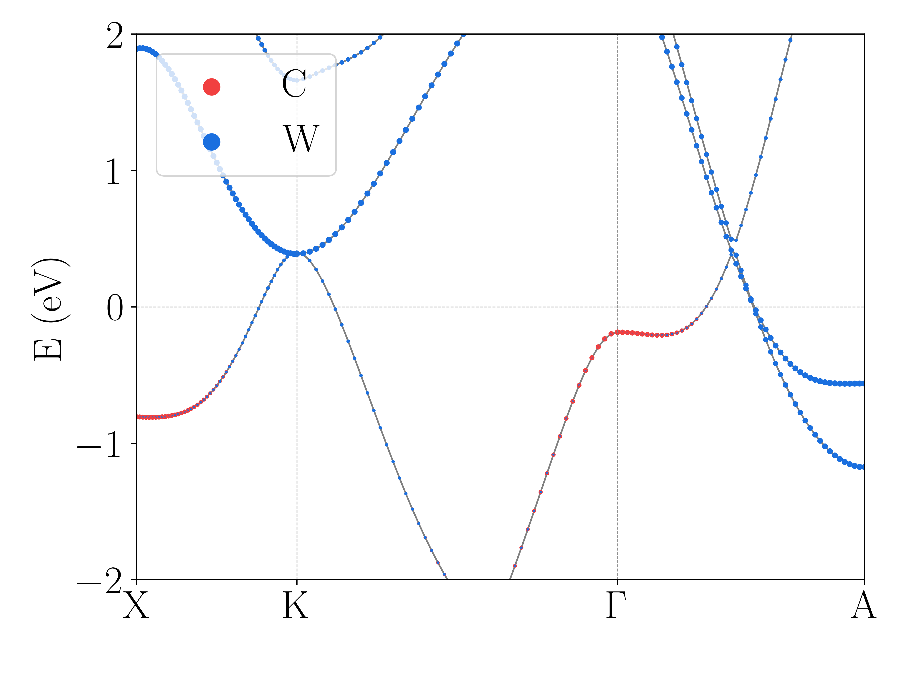

# W2TB-从WANNIER90构造紧束缚模型
[README in English](README.md)

通过读取WANNIER90输出的seedname_hr.dat文件，结合seedname.win中的信息，就可以构造出紧束缚模型哈密顿量，并且还可以计算能带。

## 具体功能
- 构造紧束缚模型
- 显示紧束缚模型的表达式，可以直接获得各种hopping的数值
- 计算能带并画图，包括普通的能带结构图和fatband图
- 分块处理紧束缚模型哈密顿量

## 安装
首先
```bash
pip install numpy sympy
```
然后
```bash
git clone +项目地址
```
或者直接下载压缩包。

## 使用示例
用碳化钨（WC）的计算作为例子

详情参考[示例](Example.ipynb)，使用Example.ipynb前需要解压wannier90_hr.dat.tar.gz

首先导入模块wann2tb，然后初始化对象并读取文件
```python
import wann2tb as wtb
WC=wtb.tb_h(fermi=8.2,dn=4,seedname="wannier90")
```
然后可以查看构造好的紧束缚模型哈密顿量的一部分（整体的矩阵太大）
```python
WC.show_Hmatrix(r1=[-1,1],r2=[-1,1],r3=[-1,1],rr=[1],cr=[1],dn=1,nm=0.15)
```

接着计算能带
```python
kpath=[[0.5,0.0,0.0],[0.33333,0.33333,0.0],[0.0,0.0,0.0],[0.0,0.0,0.5]]
klabels=[r"$\mathrm{X}$",r"$\mathrm{K}$",r"$\mathrm{\Gamma}$",r"$\mathrm{A}$"]
band=WC.band_cal(kpath=kpath,kn=50,klabels=klabels,R1r=[-2,2],R2r=[-2,2],R3r=[-2,2],rr=[0,1,2,3])
```
画出能带图
```python
wtb.band_plot(bandlist=[[band,'black',r"$\mathrm{WC}$"]],ed=-2,eu=2,filename="wholeband.png")
```


也可以对紧束缚模型哈密顿量进行分块处理，比如将自旋上和自旋下的轨道分离，分别计算能带并绘图。
```python
band_up=WC.band_cal(kpath=kpath,kn=50,klabels=klabels,R1r=[-2,2],R2r=[-2,2],R3r=[-2,2],rr=[0,1])
band_dn=WC.band_cal(kpath=kpath,kn=50,klabels=klabels,R1r=[-2,2],R2r=[-2,2],R3r=[-2,2],rr=[2,3])
wtb.band_plot(bandlist=[[band_up,wtb.red,"Spin up"],[band_dn,wtb.blue,"Spin down"]],ed=-2,eu=2,filename="spinband.png")
```

band_cal的返回值中也包括了波函数信息，因此也可以通过自带的band_plot函数画出fatband图，例如：
```python
wtb.band_plot(bandlist=[[band_up,wtb.red,r"$\mathrm{C}$",[0,0,0,0,0,0,0,0,0,1,1,1]],[band_up,wtb.blue,r"$\mathrm{W}$",[1,1,1,1,1,1,1,1,1,0,0,0]]],ed=-2,eu=2,filename="fatband.png")
```

## 联系方式
如果有需要可以通过QQ联系我
